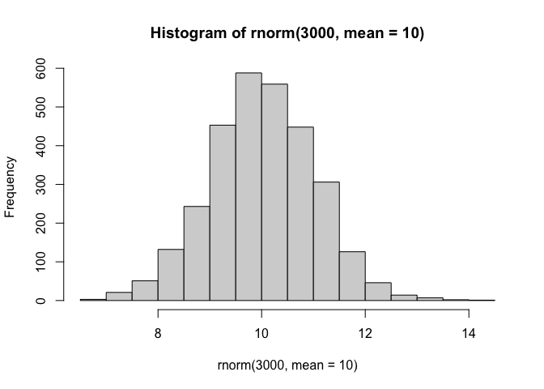
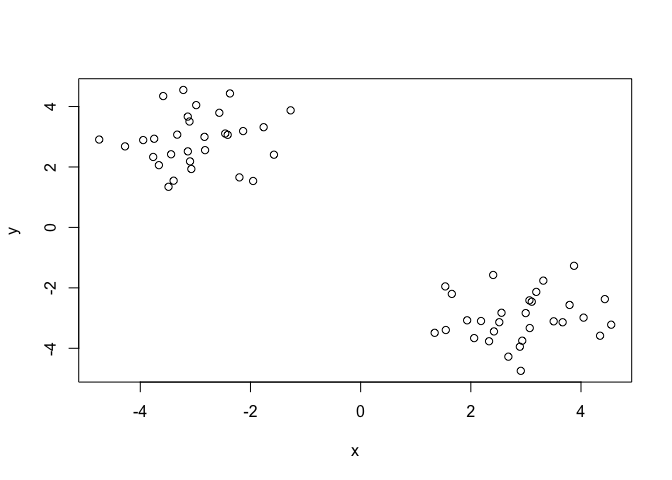
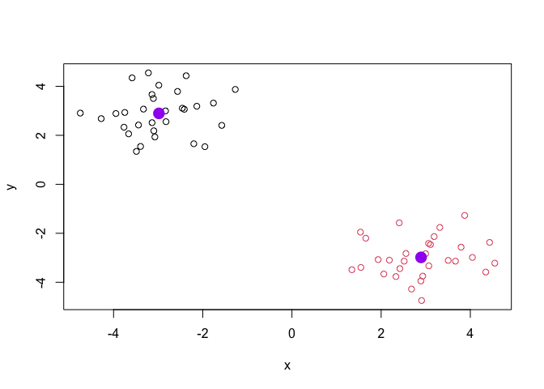
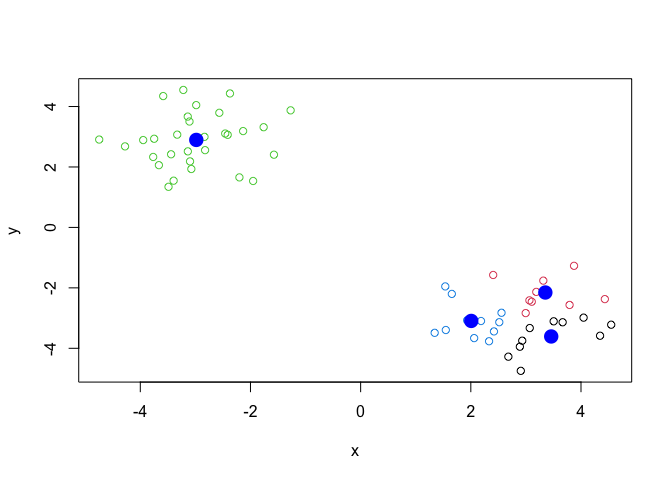
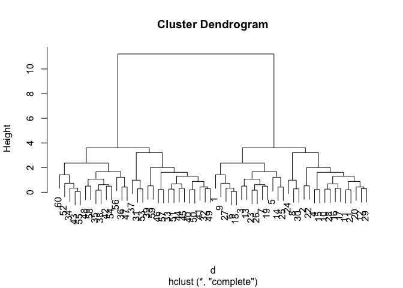
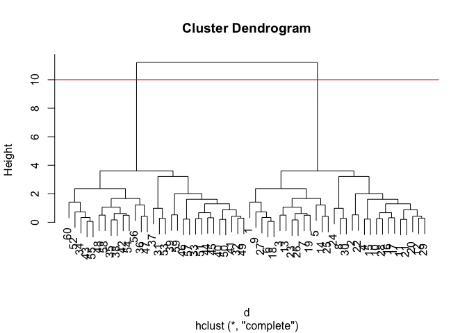
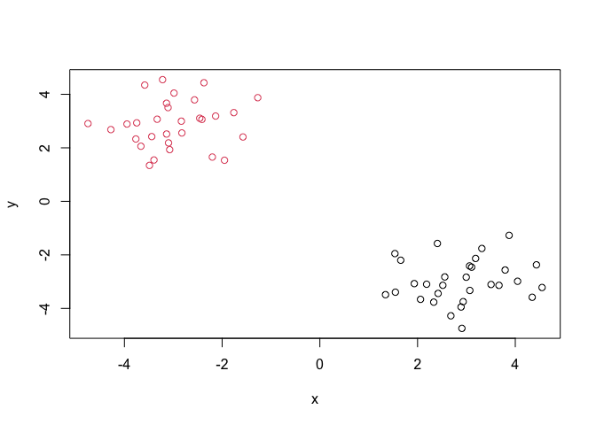
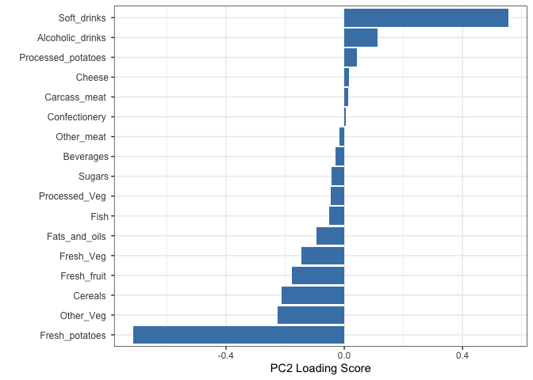

# Lab 7 Principal Component Analysis (PCA)
Cecilia Wang (PID:18625854)

## Background

Today we will begin our exploration of important machine learning
methods with a focus on **clustering** and **dimensionality reduction**.

To start testing these methods, let’s make up some sample data to
cluster where we know what the answer should be.

``` r
hist(rnorm(3000,mean=10))
```



> Q. Can you geenrate 30 numbers centered at +3 and 30 numbers at -3
> taken at random from a normal distribution?

``` r
tmp<- c(rnorm(30,mean=3), rnorm(30,mean=-3))

x<-cbind(x=tmp, y=rev(tmp))

plot(x)
```



## K-means clustering

The main function in “base R” for k-means clustering is called
`kmeans()`, let’s try it out.

``` r
k <- kmeans(x,2)
k
```

    K-means clustering with 2 clusters of sizes 30, 30

    Cluster means:
              x         y
    1 -2.983481  2.895122
    2  2.895122 -2.983481

    Clustering vector:
     [1] 2 2 2 2 2 2 2 2 2 2 2 2 2 2 2 2 2 2 2 2 2 2 2 2 2 2 2 2 2 2 1 1 1 1 1 1 1 1
    [39] 1 1 1 1 1 1 1 1 1 1 1 1 1 1 1 1 1 1 1 1 1 1

    Within cluster sum of squares by cluster:
    [1] 41.09069 41.09069
     (between_SS / total_SS =  92.7 %)

    Available components:

    [1] "cluster"      "centers"      "totss"        "withinss"     "tot.withinss"
    [6] "betweenss"    "size"         "iter"         "ifault"      

> Q. What component of your kmeans result object has the cluster center?

``` r
k$centers
```

              x         y
    1 -2.983481  2.895122
    2  2.895122 -2.983481

> Q. What component of your kmeans result object has the cluster size
> (i.e. how many points are in each cluster) ?

``` r
k$size
```

    [1] 30 30

> Q. What component of your kmeans result object has the cluster
> membership vector(i.e. the main clustering result, which points are in
> which cluster)?

``` r
k$cluster
```

     [1] 2 2 2 2 2 2 2 2 2 2 2 2 2 2 2 2 2 2 2 2 2 2 2 2 2 2 2 2 2 2 1 1 1 1 1 1 1 1
    [39] 1 1 1 1 1 1 1 1 1 1 1 1 1 1 1 1 1 1 1 1 1 1

> Q. Plot the results of cluster (i.e our data colored by the clustering
> result) along with the cluster centers.

``` r
plot(x,col=k$cluster)
points(k$center,col="purple",pch=16,cex=2)
```



> Q. Can you run kmeans again and cluster into 4 clusters and plot the
> results just like we did above with coloring by cluster and the
> cluster centers shown in blue?

``` r
k4 <- kmeans(x,4)
k4$size
```

    [1] 10  9 30 11

``` r
k4$cluster
```

     [1] 2 1 2 4 2 2 2 4 2 4 1 4 1 1 4 4 4 2 1 4 1 1 1 2 1 1 2 4 4 4 3 3 3 3 3 3 3 3
    [39] 3 3 3 3 3 3 3 3 3 3 3 3 3 3 3 3 3 3 3 3 3 3

``` r
plot(x,col=k4$cluster)
points(k4$center,col="blue",pch=16,cex=2)
```



**Key-point:** Kmeans will always return the clustering that we ask for
(this the “K” or “centers in K-means)!

## Hierarchical clustering

The main function for hierarchical clustering in base R is called
`hclust()`.One of the main differences with respect to the `kmeans()`
function is that you can not just pass your input data directly to
`hclust()` - it needs a “distance matrix” as input. We can get this from
lot’s of places including the `dist()` function.

``` r
d <- dist(x)
hc <- hclust(d)
plot(hc)
```



We can “cut” dendrogram or “tree” at a given height to yield our
“clusters”. For this we use the function `cutres()`.

``` r
plot(hc)
abline(h=10,col="red")
```



``` r
grps <- cutree(hc, h=10)
```

> Q. Plot our data `x` colored by the clustering result from
> `hclust()`and `cutree()`?

``` r
plot(x,col=grps)
```



## Principal Component Analysis (PCA)

PCA is a popular dimensionality reduction technique that is widely used
in bioinformatics.

### PCA of UK food data

``` r
url <- "https://tinyurl.com/UK-foods"
x <- read.csv(url)

rownames(x) <- x[,1]
x <- x[,-1]
head(x)
```

                   England Wales Scotland N.Ireland
    Cheese             105   103      103        66
    Carcass_meat       245   227      242       267
    Other_meat         685   803      750       586
    Fish               147   160      122        93
    Fats_and_oils      193   235      184       209
    Sugars             156   175      147       139

A better way to do this is fix the row names assignment at import time:

``` r
x <- read.csv(url, row.names=1)
head(x)
```

                   England Wales Scotland N.Ireland
    Cheese             105   103      103        66
    Carcass_meat       245   227      242       267
    Other_meat         685   803      750       586
    Fish               147   160      122        93
    Fats_and_oils      193   235      184       209
    Sugars             156   175      147       139

> Q1. How many rows and columns are in your new data frame named x? What
> R functions could you use to answer this questions?

``` r
dim(x)
```

    [1] 17  4

> Q2. Which approach to solving the ‘row-names problem’ mentioned above
> do you prefer and why? Is one approach more robust than another under
> certain circumstances?

The second method is better.

> Q5: We can use the pairs() function to generate all pairwise plots for
> our countries. Can you make sense of the following code and resulting
> figure? What does it mean if a given point lies on the diagonal for a
> given plot?

``` r
pairs(x, col=rainbow(nrow(x)), pch=16)
```


``` r
library(pheatmap)

pheatmap( as.matrix(x) )
```


> Q6. Based on the pairs and heatmap figures, which countries cluster
> together and what does this suggest about their food consumption
> patterns? Can you easily tell what the main differences between N.
> Ireland and the other countries of the UK in terms of this data-set?

Wales,England, Scotland cluster together, N.Ireland is in the other
cluster. Main difference between N.Ireland and other countries are
consumption in: Alcoholic drinks, fresh potatoes, fresh fruits, and
other meats.

Of all these plot really only the `paris()` plot was useful.This however
took a bit of work to interpret a large dataset.

**PCA to rescue**

The main function in “base R” for PCA is called `prcomp()`.

``` r
pca <- prcomp( t(x) )
summary(pca)
```

    Importance of components:
                                PC1      PC2      PC3     PC4
    Standard deviation     324.1502 212.7478 73.87622 2.7e-14
    Proportion of Variance   0.6744   0.2905  0.03503 0.0e+00
    Cumulative Proportion    0.6744   0.9650  1.00000 1.0e+00

> Q. How much varance is captured in the first PC?

67.44%

> Q. How many Pcs do I need to capture at least 90% of the total
> variance i the dataset?

2 PCs capture 96.5% total variance.

> Q. Plot our main PCA result.

``` r
attributes(pca)
```

    $names
    [1] "sdev"     "rotation" "center"   "scale"    "x"       

    $class
    [1] "prcomp"

To generate our PCA score plot we want to use the `pca$x`

``` r
# Create a data frame for plotting
df <- as.data.frame(pca$x)
df$Country <- rownames(df)

# Plot PC1 vs PC2 with ggplot
library(ggplot2)
ggplot(pca$x) +
  aes(x =PC1, y = PC2, label = rownames(pca$x)) +
  geom_point(size = 3) +
  geom_text(vjust = -0.5) +
  xlim(-270, 500) +
  xlab("PC1") +
  ylab("PC2") +
  theme_bw()
```


> Q8. Customize your plot so that the colors of the country names match
> the colors in our UK and Ireland map and table at start of this
> document.

``` r
my_cols <-c("orange","red","blue","darkgreen")

ggplot(pca$x) +
  aes(x =PC1, y = PC2, label = rownames(pca$x)) +
  geom_point(size = 3,col=my_cols) +
  geom_text(vjust = -0.5) +
  xlim(-270, 500) +
  xlab("PC1") +
  ylab("PC2") +
  theme_bw()
```


## Digging deeper (variable loadings)

How do the original variables (i.e. the 17 different foods) contribute
to our new PCs?

PC1 plot loading plot

``` r
## Lets focus on PC1 as it accounts for > 90% of variance 
ggplot(pca$rotation) +
  aes(x = PC1, 
      y = reorder(rownames(pca$rotation), PC1)) +
  geom_col(fill = "steelblue") +
  xlab("PC1 Loading Score") +
  ylab("") +
  theme_bw() +
  theme(axis.text.y = element_text(size = 9))
```


PC2 plot loading plot

``` r
ggplot(pca$rotation) +
  aes(x = PC2, 
      y = reorder(rownames(pca$rotation), PC2)) +
  geom_col(fill = "steelblue") +
  xlab("PC2 Loading Score") +
  ylab("") +
  theme_bw() +
  theme(axis.text.y = element_text(size = 9))
```


